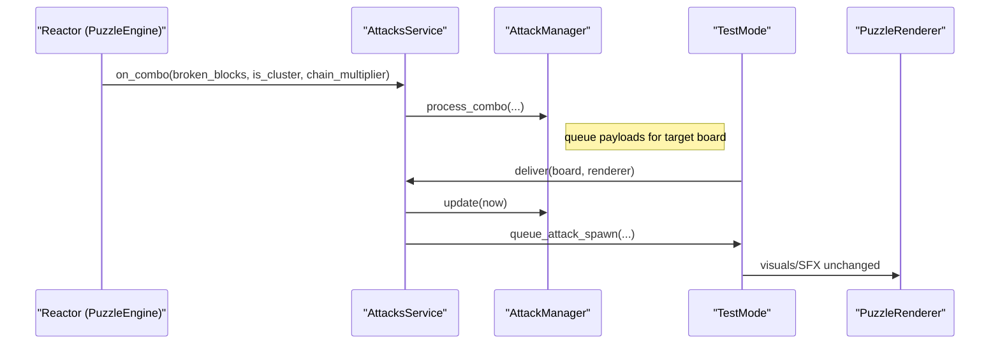

Time Source
===========

All non-reactor modules must use a unified time source to ensure deterministic behavior and testability. The `utils/clock.py` module provides a `Clock` interface with concrete implementations:

- PygameClock: wraps `pygame.time.get_ticks()` to return monotonic milliseconds when running the game
- SystemClock: wraps `time.perf_counter()` for headless runs
- FakeClock: deterministic test double with `advance(ms)`

Wiring
------

- `GameClient` owns a `Clock` (default `PygameClock`) and passes it to subsystems. The clock is attached to the puzzle engines as `engine.clock`, and passed into `PuzzleRenderer` and `TestMode`.
- Input repeat/debounce logic in `core/input_handler.py` uses `engine.clock.now_ms()`.
- `core/puzzle_renderer.py` uses `clock.now_ms()` for animation and throttling, converting to seconds with `now_ms()/1000` when needed.
- `modules/testmode_module` routes time via the injected clock and avoids direct `time.time()` or `pygame.time.get_ticks()`.

Configuration
-------------

Repeat rates are configurable via `modules/settings_module/config_service.py`:

- `repeat_initial_delay_ms` (default 120)
- `repeat_interval_ms` (default 80)
- `repeat_move_interval_ms` (default 500)
- `repeat_rotate_interval_ms` (default 600)

These are read by `InputHandler` during initialization.

Testing
-------

Use `FakeClock` to advance time deterministically in unit tests. Tests should construct subsystems with the fake clock and call `advance(ms)` to simulate time passage without relying on real timers or frame steps.

Input Feel Tuner Overlay
------------------------

- Toggle in-game with F9. Overlay shows and lets you tune:
  - `repeat_initial_delay_ms`
  - `repeat_interval_ms`
  - `repeat_move_interval_ms`
  - `repeat_rotate_interval_ms`
- Use Up/Down to select, Left/Right or +/- to adjust, hold Shift for larger steps.
- Changes persist immediately via the `ConfigService` and apply live to `core/input_handler.py`.
- The overlay also lists recent key events with timestamps and deltas for debugging.

Sprite Atlas & Animations
-------------------------

- Packing: `python tools/packer/pack.py --in content/sprites/raw --out content/sprites/build`
- Output `atlas.json` schema:
  { "sheet": "spritesheet.png",
    "frames": [{"name":"plasma_0001","x":0,"y":0,"w":32,"h":32,"duration_ms":80}],
    "anims": {"plasma":["plasma_0001","plasma_0002"]} }
- Runtime: `core/gfx/anim_player.py` loads an atlas, plays by name at a rate, supports per-frame durations and looping, and draws to a surface.
- The renderer can optionally overlay a sparkle break effect if `puzzleassets/magic/sparkle_atlas.json` exists.

Movement Gate & Cadence
-----------------------

- Land gate: When a piece lands, logical movement/rotation/drop intents are ignored until the next spawn. UI/system keys continue to work. This eliminates post-land jitter and accidental inputs.
- DAS/ARR/Tap grace:
  - Immediate tap: initial keydown emits one step immediately.
  - DAS (`repeat_initial_delay_ms`): hold delay before auto-repeats begin.
  - ARR (`repeat_move_interval_ms`): repeat cadence while held after DAS.
  - Tap grace (`tap_grace_ms`): releases within this window never transition into repeats.
  - Rotation repeats on its own cadence (`repeat_rotate_interval_ms`).
- Safe wall-kick (1-cell): rotation tries in-place, then ±1 horizontal kick if fully legal; otherwise cancels. No vertical slides, no out-of-bounds.

Asset Preflight & Logging
-------------------------

- Central logging is provided by `modules/logging_module/logger.py` with `configure_logging(level, file_path)` and `get_logger(name)`.
- At startup, `GameClient` configures logging and runs an asset preflight using `modules/asset_module/preflight.AssetPreflight`.
- Preflight checks:
  - Images in `puzzleassets/` are present and load via `pygame.image.load`
  - Sounds under `sounds/effects` and `sounds/songs` exist (size > 0)
  - Config JSONs parse: `game_settings.json`, `game_controls.json`, `ui_positions.json`, `puzzleassets/items_config.json`
  - Fonts in `puzzleassets/fonts/*.ttf` can open (warnings only)
- Report format returned and written by CLI tool:
  ```json
  { "ok": true, "errors": ["..."], "warnings": ["..."], "counts": { "images_checked": 0, "sounds_checked": 0, "configs_checked": 0, "fonts_checked": 0 } }
  ```
- On startup, a one-line summary is logged; errors/warnings are logged individually. If not ok, a small non-blocking toast appears briefly on the main UI.
- Toggle via setting `run_asset_preflight: true` in `game_settings.json` (default true).

Record/Replay & Repro Tokens
----------------------------

- Session schema:
  ```json
  {
    "seed": 123,
    "settings": {"repeat_initial_delay_ms": 120, "repeat_move_interval_ms": 80},
    "events": [
      {"t_ms": 0, "intent": "move_r", "data": {}},
      {"t_ms": 120, "intent": "move_r", "data": {}},
      {"t_ms": 200, "intent": "rotate", "data": {"dir": 1}}
    ]
  }
  ```
- Recording: `InputRecorder` collects normalized intents from `core/input_handler.pop_intents()`.
- Replay: `InputReplayer.step(now_ms)` returns due intents; the client applies them instead of live input.
- CLI flags: `--record /path/sess.json`, `--replay /path/or/token`, `--seed 123`.
- Repro Token: `tools/repro_token.py` packs session JSON into a url-safe base64+gzip with checksum.

AttacksService Facade
---------------------

Centralizes attack flow outside the reactor.

- Responsibilities:
  - Receive combo callbacks from the reactor `blocks_broken_handler` with `(broken_blocks, is_cluster, chain_multiplier)` and `player_id`.
  - Delegate to `modules/attack_module/attack_manager.py` for all calculations and queueing.
  - Translate queued attacks into Test Mode’s existing placement paths (garbage sprinkles and strikes), triggering visuals/SFX as before.
  - Optionally accept placement/demotion policies in the future via `set_policies()`.
- Dependencies:
  - `modules/attack_module/attack_manager.py`
  - `modules/items_module/*` (for item effects integration later)
  - `utils/clock.Clock`
  - settings module (configs)
- Reactor callback boundary: the service exposes `on_combo(...)` and must be wired by modes without importing reactor internals.

Sequence diagram:



Attack Delivery: Animated Spawns
--------------------------------

- Sequence: on_combo -> AttacksService -> queue_attack_spawn -> fall -> land -> place
- `attacks.spawn_mode` (ConfigService):
  - `animated` (default): enqueue falling payloads. Spawns begin with start_y < 0 and only mutate the grid upon landing completion.
  - `instant`: direct placement when the spawn queue is processed (for tools/tests).
- Renderer guardrails: Falling entities are handled by the animation state and are excluded from landing snap logic for the player’s active piece until they actually land.

Landing Stability
-----------------

To eliminate visible “bounce” when pieces land, the renderer implements a conservative snap-and-clamp policy that does not alter reactor logic:

- Snap on land: On the exact frame where the engine reports that a falling pair would no longer fit below, the renderer stops vertical easing and snaps the visual Y to the destination grid row.
- Clamp while falling: While still falling, projected visual Y is clamped to never exceed the boundary of the next cell. A configurable epsilon ensures we never draw below the final cell.
- Per-board isolation: Player and enemy boards each instantiate their own `AnimationStateManager` and keep independent animation state dictionaries to avoid cross-talk. Tests assert instances differ.

Settings:
- `renderer.snap_on_land` (default true)
- `renderer.landing_epsilon_px` (default 0)

